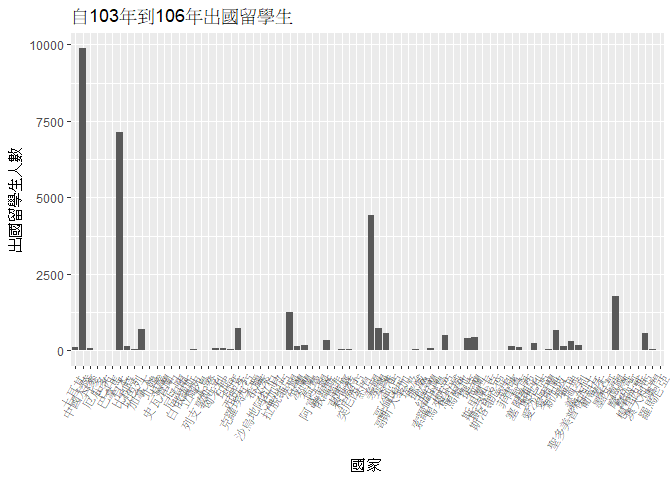
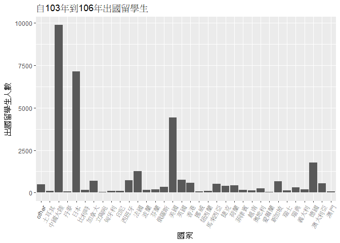
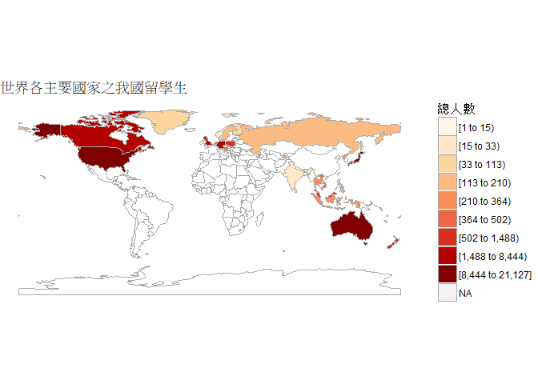

106-2 大數據分析方法 作業二
================
Yi-Ju Tseng

作業完整說明[連結](https://docs.google.com/document/d/1aLGSsGXhgOVgwzSg9JdaNz2qGPQJSoupDAQownkGf_I/edit?usp=sharing)

學習再也不限定在自己出生的國家，台灣每年有許多學生選擇就讀國外的大專院校，同時也有人多國外的學生來台灣就讀，透過分析[大專校院境外學生人數統計](https://data.gov.tw/dataset/6289)、[大專校院本國學生出國進修交流數](https://data.gov.tw/dataset/24730)、[世界各主要國家之我國留學生人數統計表](https://ws.moe.edu.tw/Download.ashx?u=C099358C81D4876CC7586B178A6BD6D5062C39FB76BDE7EC7685C1A3C0846BCDD2B4F4C2FE907C3E7E96F97D24487065577A728C59D4D9A4ECDFF432EA5A114C8B01E4AFECC637696DE4DAECA03BB417&n=4E402A02CE6F0B6C1B3C7E89FDA1FAD0B5DDFA6F3DA74E2DA06AE927F09433CFBC07A1910C169A1845D8EB78BD7D60D7414F74617F2A6B71DC86D17C9DA3781394EF5794EEA7363C&icon=..csv)可以了解103年以後各大專院校國際交流的情形。請同學分析以下議題，並以視覺化的方式呈現分析結果，呈現103年以後大專院校國際交流的情形。

來台境外生分析
--------------

### 資料匯入與處理

``` r
library(jsonlite)
```

    ## Warning: package 'jsonlite' was built under R version 3.4.4

``` r
library(dplyr)
```

    ## 
    ## Attaching package: 'dplyr'

    ## The following objects are masked from 'package:stats':
    ## 
    ##     filter, lag

    ## The following objects are masked from 'package:base':
    ## 
    ##     intersect, setdiff, setequal, union

``` r
library(choroplethr)
```

    ## Warning: package 'choroplethr' was built under R version 3.4.4

    ## Loading required package: acs

    ## Warning: package 'acs' was built under R version 3.4.4

    ## Loading required package: stringr

    ## Warning: package 'stringr' was built under R version 3.4.4

    ## Loading required package: XML

    ## 
    ## Attaching package: 'acs'

    ## The following object is masked from 'package:dplyr':
    ## 
    ##     combine

    ## The following object is masked from 'package:base':
    ## 
    ##     apply

``` r
library(readr)
library(ggplot2)
```

    ## Warning: package 'ggplot2' was built under R version 3.4.4

``` r
#讀入103到106的各國來台學生資料
data103<-
  fromJSON("https://quality.data.gov.tw/dq_download_json.php?nid=6289&md5_url=25f64d5125016dcd6aed42e50c972ed0")
data104<-
  fromJSON("https://quality.data.gov.tw/dq_download_json.php?nid=6289&md5_url=4d3e9b37b7b0fd3aa18a388cdbc77996")
data105<-
  fromJSON("https://quality.data.gov.tw/dq_download_json.php?nid=6289&md5_url=19bedf88cf46999da12513de755c33c6")
data106<-
  fromJSON("https://quality.data.gov.tw/dq_download_json.php?nid=6289&md5_url=50e3370f9f8794f2054c0c82a2ed8c91")
#為了統一103到106年的資料的欄位名稱
colname<-c("洲別","國別","學位生_正式修讀學位外國生",
           "學位生_僑生","學位生_正式修讀學位陸生",
           "非學位生_外國交換生","非學位生_外國短期研習及個人選讀",
           "非學位生_大專附設華語文中心學生","非學位生_大陸研修生",
           "非學位生_海青班","境外專班")
colnames(data103)<-colname
colnames(data104)<-colname
colnames(data105)<-colname
colnames(data106)<-colname
#以相同欄位名稱把103到106年的資料rbind起來
data103to106<-rbind(data103,data104,data105,data106)
#為了要做算術加總將各個欄位的值轉為數字
data103to106$學位生_正式修讀學位外國生<-
  as.numeric(data103to106$學位生_正式修讀學位外國生)
data103to106$學位生_僑生<-
  as.numeric(data103to106$學位生_僑生)
data103to106$學位生_正式修讀學位陸生<-
  as.numeric(data103to106$學位生_正式修讀學位陸生)
data103to106$非學位生_外國交換生<-
  as.numeric(data103to106$非學位生_外國交換生)
data103to106$非學位生_外國短期研習及個人選讀<-
  as.numeric(data103to106$非學位生_外國短期研習及個人選讀)
data103to106$非學位生_大專附設華語文中心學生<-
  as.numeric(data103to106$非學位生_大專附設華語文中心學生)
data103to106$非學位生_大陸研修生<-
  as.numeric(data103to106$非學位生_大陸研修生)
data103to106$非學位生_海青班<-
  as.numeric(data103to106$非學位生_海青班)
data103to106$境外專班<-
  as.numeric(data103to106$境外專班)

#讀入各校103年到106年各國來台境外生人數
data103_U<-fromJSON("https://quality.data.gov.tw/dq_download_json.php?nid=6289&md5_url=a6d1469f39fe41fb81dbfc373aef3331")
data104_U<-fromJSON("https://quality.data.gov.tw/dq_download_json.php?nid=6289&md5_url=8baeae81cba74f35cf0bb1333d3d99f5")
data105_U<-fromJSON("https://quality.data.gov.tw/dq_download_json.php?nid=6289&md5_url=1a485383cf9995da679c3798ab4fd681")
data106_U<-fromJSON("https://quality.data.gov.tw/dq_download_json.php?nid=6289&md5_url=883e2ab4d5357f70bea9ac44a47d05cc")
#為了統一103到106年的資料的欄位名稱
colname_U<-c("學校類型","學校代碼",
           "學校名稱","學位生_正式修讀學位外國生",
           "學位生_僑生","學位生_正式修讀學位陸生",
           "非學位生_外國交換生","非學位生_外國短期研習及個人選讀",
           "非學位生_大專附設華語文中心學生","非學位生_大陸研修生",
           "非學位生_海青班","境外專班")
colnames(data103_U)<-colname_U
colnames(data104_U)<-colname_U
colnames(data105_U)<-colname_U
colnames(data106_U)<-colname_U
#以相同欄位名稱把103到106年的資料rbind起來
data103to106_U<-rbind(data103_U,data104_U,data105_U,data106_U)
#為了要做算術加總將各個欄位的值轉為數字
data103to106_U$學位生_正式修讀學位外國生<-
  as.numeric(data103to106_U$學位生_正式修讀學位外國生)
data103to106_U$學位生_僑生<-
  as.numeric(data103to106_U$學位生_僑生)
data103to106_U$學位生_正式修讀學位陸生<-
  as.numeric(data103to106_U$學位生_正式修讀學位陸生)
data103to106_U$非學位生_外國交換生<-
  as.numeric(data103to106_U$非學位生_外國交換生)
data103to106_U$非學位生_外國短期研習及個人選讀<-
  as.numeric(data103to106_U$非學位生_外國短期研習及個人選讀)
data103to106_U$非學位生_大專附設華語文中心學生<-
  as.numeric(data103to106_U$非學位生_大專附設華語文中心學生)
#將資料中有...這種的奇怪資料先轉成NA
data103to106_U[grepl("…",data103to106_U$非學位生_大陸研修生),10]<-NA
data103to106_U$非學位生_大陸研修生<-
  as.numeric(data103to106_U$非學位生_大陸研修生)
data103to106_U$非學位生_海青班<-
  as.numeric(data103to106_U$非學位生_海青班)
data103to106_U$境外專班<-
  as.numeric(data103to106_U$境外專班)
```

### 哪些國家來台灣唸書的學生最多呢？

``` r
#將題目所需的留學生的資料作加總再排序
data103to106%>%
  group_by(國別)%>%
  mutate(總人數=學位生_正式修讀學位外國生+
                學位生_正式修讀學位陸生+
                學位生_僑生+
                非學位生_外國交換生+
                非學位生_外國短期研習及個人選讀+
                非學位生_大專附設華語文中心學生+
                非學位生_大陸研修生+
                非學位生_海青班+
                境外專班)%>%
  summarise(總留學生人數=sum(總人數))%>%
  arrange(desc(總留學生人數))%>%
  select(國別,總留學生人數)%>%
  head(10)%>%
  knitr::kable()
```

    ## Warning: package 'bindrcpp' was built under R version 3.4.4

| 國別     | 總留學生人數 |
|:---------|:------------:|
| 中國大陸 |    152524    |
| 馬來西亞 |     62031    |
| 香港     |     31940    |
| 日本     |     28200    |
| 越南     |     21670    |
| 澳門     |     20302    |
| 印尼     |     19620    |
| 南韓     |     16948    |
| 美國     |     14846    |
| 泰國     |     7035     |

### 哪間大學的境外生最多呢？

``` r
data103to106_U%>%
  group_by(學校名稱)%>%
  mutate(總人數=學位生_正式修讀學位外國生+
              學位生_正式修讀學位陸生+
              學位生_僑生+
              非學位生_外國交換生+
              非學位生_外國短期研習及個人選讀+
              非學位生_大專附設華語文中心學生+
              非學位生_大陸研修生+
              非學位生_海青班+
              境外專班)%>%
  summarise(最終總人數=sum(總人數,na.rm=T))%>%
  arrange(desc(最終總人數))%>%
  select(學校名稱,最終總人數)%>%
  filter(學校名稱!="無法區分校別")%>%
  head(10)%>%
  knitr::kable()
```

| 學校名稱         | 最終總人數 |
|:-----------------|:----------:|
| 國立臺灣師範大學 |    12137   |
| 國立臺灣大學     |    9885    |
| 銘傳大學         |    8453    |
| 中國文化大學     |    7749    |
| 淡江大學         |    7647    |
| 國立政治大學     |    6050    |
| 國立成功大學     |    6043    |
| 逢甲大學         |    4963    |
| 輔仁大學         |    4952    |
| 中原大學         |    4606    |

### 各個國家來台灣唸書的學生人數條狀圖

``` r
#為了作圖方便將欄位作人數加總並且只留下需要的欄位
dataToBar<-
  data103to106%>%
    group_by(洲別,國別)%>%
    mutate(總人數=學位生_正式修讀學位外國生+
              學位生_正式修讀學位陸生+
              學位生_僑生+
              非學位生_外國交換生+
              非學位生_外國短期研習及個人選讀+
              非學位生_大專附設華語文中心學生+
              非學位生_大陸研修生+
              非學位生_海青班+
              境外專班)%>%
    summarise(最終總人數=sum(總人數))%>%
    arrange(desc(最終總人數))
#以剛剛做好的資料作Bar chart圖
ggplot(dataToBar,aes(國別,最終總人數))+
  geom_bar(stat = "identity")+
  labs(x="國家",y="來台留學生人數",title="自103年到106年各國來台學生")+
  theme(axis.text.x = element_text(angle = 60, hjust = 1))
```


``` r
#因為太過密集，下面將一個一個洲分開來畫圖表
dataToBar_list<-#分別取出各洲資料放入list
  list(dataToBar_Asia<-dataToBar[dataToBar$洲別=="亞洲",],
    dataToBar_America<-dataToBar[dataToBar$洲別=="美洲",],
    dataToBar_Africa<-dataToBar[dataToBar$洲別=="非洲",],
    dataToBar_Europe<-dataToBar[dataToBar$洲別=="歐洲",],
    dataToBar_Oceania<-dataToBar[dataToBar$洲別=="大洋洲",])
Bartitle<-c("亞洲","美洲","非洲","歐洲","大洋洲")#各洲圖的title

for(i in 1:5){#將list裡的dataframe一一取出來作圖
  print(
      ggplot(dataToBar_list[[i]],aes(國別,最終總人數))+
        geom_bar(stat = "identity")+
        labs(x="國家",
             y="來台留學生人數",
             title=paste0(Bartitle[i],"  自103年到106年各國來台學生"))+
        theme(axis.text.x = element_text(angle = 60, hjust = 1))
  )
}
```


### 各個國家來台灣唸書的學生人數面量圖

``` r
#讀入在目錄下的中英國名對照csv表
CountriesComparisionTable<-
  read_csv("CountriesComparisionTable.csv")
```

    ## Parsed with column specification:
    ## cols(
    ##   ISO3 = col_character(),
    ##   English = col_character(),
    ##   Taiwan = col_character()
    ## )

``` r
CountriesComparisionTable$ISO3<-NULL#清除不必要的欄位
#將英文的國家名稱加入表格
dataToBar<-left_join(dataToBar,CountriesComparisionTable,by=c("國別"="Taiwan"))
#若要以choroplethr作面量圖的話必須是一個只有region和value欄位的dataframe
choropleth = data.frame(region=dataToBar$English, value=dataToBar$最終總人數)
#因為用choroplethr做面量圖不能有重複的資料，刪除重複的資料(也就是Unmatch或NA的資料)
choropleth<-choropleth[!duplicated(choropleth$region),]
#以country level來作面量圖，並存放至foreginstudent_choropleth
foreginstudent_choropleth<-
  country_choropleth(choropleth,"自103年到106年各國來台學生",num_colors=9)+
    scale_fill_brewer("總人數",palette=1)
```

    ## Warning in super$initialize(country.map, user.df): Your data.frame contains
    ## the following regions which are not mappable: Unmatch, Singapore, NA

    ## Warning: Column `region` joining character vector and factor, coercing into
    ## character vector

    ## Warning in self$bind(): The following regions were missing and are
    ## being set to NA: afghanistan, angola, montenegro, qatar, western sahara,
    ## somaliland, east timor, taiwan, vanuatu, central african republic, northern
    ## cyprus, djibouti, eritrea, antarctica, equatorial guinea, kosovo, lesotho

    ## Scale for 'fill' is already present. Adding another scale for 'fill',
    ## which will replace the existing scale.

``` r
#將剛存放的面量圖畫出
foreginstudent_choropleth
```


台灣學生國際交流分析
--------------------

### 資料匯入與處理

``` r
#讀入在目錄下的台灣學生出國留學csv表
TaiwanStudent<-
  read_csv("Student_RPT_07.csv")
```

    ## Parsed with column specification:
    ## cols(
    ##   學年度 = col_integer(),
    ##   學期 = col_integer(),
    ##   設立別 = col_character(),
    ##   學校類別 = col_character(),
    ##   學校代碼 = col_integer(),
    ##   學校名稱 = col_character(),
    ##   系所代碼 = col_integer(),
    ##   系所名稱 = col_character(),
    ##   學制 = col_character(),
    ##   對方學校.機構.國別.地區. = col_character(),
    ##   中文名稱 = col_character(),
    ##   英文名稱 = col_character(),
    ##   小計 = col_integer(),
    ##   男 = col_integer(),
    ##   女 = col_integer()
    ## )

    ## Warning in rbind(names(probs), probs_f): number of columns of result is not
    ## a multiple of vector length (arg 1)

    ## Warning: 9 parsing failures.
    ## row # A tibble: 5 x 5 col     row col      expected               actual file                 expected   <int> <chr>    <chr>                  <chr>  <chr>                actual 1  2340 學校代碼 no trailing characters R01    'Student_RPT_07.csv' file 2  2341 學校代碼 no trailing characters R01    'Student_RPT_07.csv' row 3  2342 學校代碼 no trailing characters R01    'Student_RPT_07.csv' col 4  6076 學校代碼 no trailing characters R01    'Student_RPT_07.csv' expected 5  6077 學校代碼 no trailing characters R01    'Student_RPT_07.csv'
    ## ... ................. ... ................................................................... ........ ................................................................... ...... ............................................................... .... ............................................................... ... ............................................................... ... ............................................................... ........ ...............................................................
    ## See problems(...) for more details.

``` r
#取出各個國家和總人數欄位
TaiwanStudent_clean<-
  TaiwanStudent%>%
    filter(學年度>=103)%>%
    group_by(對方學校.機構.國別.地區.)%>%
    summarise(總人數=sum(小計))%>%
    arrange(desc(總人數))
#將總人數欄位轉成數字
TaiwanStudent_clean$總人數<-as.numeric(TaiwanStudent_clean$總人數)
#因為發現資料中有很多想同國家但表示方式不同，所以以下gsub再將國家名稱一致化
TaiwanStudent_clean$對方學校.機構.國別.地區.<-
  gsub("共和國|和平之國|王國|侯國|聯邦|哈什米王國|阿拉伯共和國|泰王國|民主社會主義共和國|合眾國|大韓民國|大公國|社會主義|民主|伊斯蘭",
       "",
       TaiwanStudent_clean$對方學校.機構.國別.地區.)
#差異較大的名稱一一取出再做總人數的加總
TaiwanStudent_clean[TaiwanStudent_clean[,1]=='中國大陸',2]<-
  TaiwanStudent_clean[TaiwanStudent_clean[,1]=='大陸地區',2]+
  TaiwanStudent_clean[TaiwanStudent_clean[,1]=='中國大陸',2]

TaiwanStudent_clean[TaiwanStudent_clean[,1]=='南韓',2]<-
  TaiwanStudent_clean[TaiwanStudent_clean[,1]=='南韓',2]+
  TaiwanStudent_clean[TaiwanStudent_clean[,1]=='(南韓)',2]

TaiwanStudent_clean[TaiwanStudent_clean[,1]=='泰國',2]<-
  TaiwanStudent_clean[TaiwanStudent_clean[,1]=='泰國',2]+
  TaiwanStudent_clean[TaiwanStudent_clean[,1]=='(泰國)',2]

TaiwanStudent_clean[TaiwanStudent_clean[,1]=='德國',2]<-
  TaiwanStudent_clean[TaiwanStudent_clean[,1]=='德國',2]+
  TaiwanStudent_clean[TaiwanStudent_clean[,1]=='德意志',2]

TaiwanStudent_clean[TaiwanStudent_clean[,1]=='蒙古',2]<-
  TaiwanStudent_clean[TaiwanStudent_clean[,1]=='蒙古',2]+
  TaiwanStudent_clean[TaiwanStudent_clean[,1]=='蒙古國',2]

TaiwanStudent_clean[TaiwanStudent_clean[,1]=='印尼',2]<-
  TaiwanStudent_clean[TaiwanStudent_clean[,1]=='印尼',2]+
  TaiwanStudent_clean[TaiwanStudent_clean[,1]=='印度尼西亞',2]
#經過處理以後資料表中便有許多相同的國家，再將相同的國家總人數加起來
TaiwanStudent_clean<-
  TaiwanStudent_clean%>%
  group_by(對方學校.機構.國別.地區.)%>%
  summarise(總人數=sum(總人數))%>%
  arrange(desc(總人數))
#將剛剛差異較大的名稱的row移除
TaiwanStudent_clean<-TaiwanStudent_clean[
  !grepl("大陸地區|(南韓)|(泰國)|德意志|蒙古國|印度尼西亞",
         TaiwanStudent_clean$對方學校.機構.國別.地區.),]
```

### 台灣大專院校的學生最喜歡去哪些國家進修交流呢？

``` r
#將資料做排序並取出前10多學生的國家
TaiwanStudent_clean%>%
  arrange(desc(總人數))%>%
  head(10)%>%
  knitr::kable()
```

| 對方學校.機構.國別.地區. | 總人數 |
|:-------------------------|:------:|
| 中國大陸                 |  9891  |
| 日本                     |  7142  |
| 美國                     |  4427  |
| 德國                     |  1764  |
| 法國                     |  1258  |
| 英國                     |   742  |
| 西班牙                   |   721  |
| 加拿大                   |   689  |
| 新加坡                   |   673  |
| 香港                     |   572  |

### 哪間大學的出國交流學生數最多呢？

``` r
TaiwanStudent%>%
  group_by(學校名稱)%>%
  summarise(總人數=sum(小計))%>%
  arrange(desc(總人數))%>%
  head(10)%>%
  knitr::kable()
```

| 學校名稱     | 總人數 |
|:-------------|:------:|
| 國立臺灣大學 |  4719  |
| 淡江大學     |  3794  |
| 國立政治大學 |  3479  |
| 逢甲大學     |  2646  |
| 東海大學     |  1881  |
| 元智大學     |  1864  |
| 國立交通大學 |  1513  |
| 東吳大學     |  1457  |
| 國立成功大學 |  1397  |
| 國立臺北大學 |  1397  |

### 台灣大專院校的學生最喜歡去哪些國家進修交流條狀圖

``` r
ggplot(TaiwanStudent_clean,aes(對方學校.機構.國別.地區.,總人數))+
  geom_bar(stat = "identity")+
  labs(x="國家",y="出國留學生人數",title="自103年到106年出國留學生")+
  theme(axis.text.x = element_text(angle = 60, hjust = 1))
```



``` r
#因為太多國家導致圖表看起來很滿，所以把少於100的國家加總起來成為Other
dataToBAR<-
  rbind(head(TaiwanStudent_clean,33),
      slice(TaiwanStudent_clean,34:n()) %>% 
        summarise(對方學校.機構.國別.地區.="other",總人數=sum(總人數))
)
#所有大於100的國家畫長條圖
ggplot(dataToBAR,aes(對方學校.機構.國別.地區.,總人數))+
  geom_bar(stat = "identity")+
  labs(x="國家",y="出國留學生人數",title="自103年到106年出國留學生")+
  theme(axis.text.x = element_text(angle = 60, hjust = 1))
```



### 台灣大專院校的學生最喜歡去哪些國家進修交流面量圖

``` r
#將英文國家名稱加入資料表
TaiwanStudent_clean<-left_join(TaiwanStudent_clean,CountriesComparisionTable,
                               by=c("對方學校.機構.國別.地區."="Taiwan"))
#若要以choroplethr作面量圖的話必須是一個只有region和value欄位的dataframe
choropleth = data.frame(region=TaiwanStudent_clean$English, value=TaiwanStudent_clean$總人數)
#因為用choroplethr做面量圖不能有重複的資料，刪除重複的資料(也就是剛剛Unmatch的資料)
choropleth<-choropleth[!duplicated(choropleth$region),]
#以country level來作面量圖，並存放至TaiwanStudent_choropleth中
TaiwanStudent_choropleth<-
  country_choropleth(choropleth,"自103年到106年大專院校出國留學生",num_colors=9)+
    scale_fill_brewer("總人數",palette=2)
```

    ## Warning in super$initialize(country.map, user.df): Your data.frame contains
    ## the following regions which are not mappable: Singapore, Unmatch, NA

    ## Warning: Column `region` joining character vector and factor, coercing into
    ## character vector

    ## Warning in self$bind(): The following regions were missing and are being
    ## set to NA: angola, azerbaijan, moldova, madagascar, macedonia, mali,
    ## myanmar, montenegro, mozambique, mauritania, burundi, namibia, nigeria,
    ## nicaragua, pakistan, papua new guinea, north korea, benin, paraguay,
    ## rwanda, western sahara, sudan, burkina faso, south sudan, senegal, sierra
    ## leone, el salvador, somaliland, somalia, suriname, syria, chad, togo,
    ## thailand, tajikistan, turkmenistan, east timor, bulgaria, trinidad and
    ## tobago, taiwan, united republic of tanzania, uganda, ukraine, uruguay,
    ## uzbekistan, the bahamas, venezuela, vanuatu, yemen, zambia, zimbabwe,
    ## bosnia and herzegovina, albania, belize, bolivia, bhutan, botswana, central
    ## african republic, united arab emirates, ivory coast, cameroon, democratic
    ## republic of the congo, republic of congo, cuba, northern cyprus, cyprus,
    ## argentina, djibouti, dominican republic, algeria, eritrea, armenia,
    ## ethiopia, fiji, gabon, georgia, ghana, antarctica, guinea, gambia, guinea
    ## bissau, equatorial guinea, guatemala, guyana, honduras, haiti, iran, iraq,
    ## jamaica, kazakhstan, kenya, kyrgyzstan, kosovo, laos, lebanon, liberia,
    ## libya, lesotho, luxembourg

    ## Scale for 'fill' is already present. Adding another scale for 'fill',
    ## which will replace the existing scale.

``` r
#將剛存放的面量圖畫出
TaiwanStudent_choropleth
```


台灣學生出國留學分析
--------------------

### 資料匯入與處理

``` r
#讀入留學生資料
Exchangestudent<-read_csv("https://ws.moe.edu.tw/Download.ashx?u=C099358C81D4876CC7586B178A6BD6D5062C39FB76BDE7EC7685C1A3C0846BCDD2B4F4C2FE907C3E7E96F97D24487065577A728C59D4D9A4ECDFF432EA5A114C8B01E4AFECC637696DE4DAECA03BB417&n=4E402A02CE6F0B6C1B3C7E89FDA1FAD0B5DDFA6F3DA74E2DA06AE927F09433CFBC07A1910C169A1845D8EB78BD7D60D7414F74617F2A6B71DC86D17C9DA3781394EF5794EEA7363C&icon=..csv")
```

    ## Warning: Missing column names filled in: 'X4' [4], 'X5' [5], 'X6' [6]

    ## Parsed with column specification:
    ## cols(
    ##   洲別 = col_character(),
    ##   國別 = col_character(),
    ##   總人數 = col_number(),
    ##   X4 = col_character(),
    ##   X5 = col_character(),
    ##   X6 = col_character()
    ## )

``` r
#清除空白欄位
Exchangestudent[,4:6]<-NULL
#將總人數欄位轉成數字
Exchangestudent$總人數<-as.numeric(Exchangestudent$總人數)
```

### 台灣學生最喜歡去哪些國家留學呢？

``` r
#取出總人數欄位再排序
Exchangestudent%>%
  arrange(desc(總人數))%>%
  select('國別','總人數')%>%
  head(10)%>%
  knitr::kable()
```

| 國別     | 總人數 |
|:---------|:------:|
| 美國     |  21127 |
| 澳大利亞 |  13582 |
| 日本     |  8444  |
| 加拿大   |  4827  |
| 英國     |  3815  |
| 德國     |  1488  |
| 紐西蘭   |  1106  |
| 波蘭     |   561  |
| 馬來西亞 |   502  |
| 奧地利   |   419  |

### 台灣學生最喜歡去哪些國家留學面量圖

``` r
#將英文國家名稱加入資料表
Exchangestudent<-left_join(Exchangestudent,CountriesComparisionTable,
                               by=c("國別"="Taiwan"))
#若要以choroplethr作面量圖的話必須是一個只有region和value欄位的dataframe
choropleth = data.frame(region=Exchangestudent$English, value=Exchangestudent$總人數)
#因為用choroplethr做面量圖不能有重複的資料，刪除重複的資料(也就是剛剛Unmatch的資料)
choropleth<-choropleth[!duplicated(choropleth$region),]
#以country level來作面量圖
country_choropleth(choropleth,"世界各主要國家之我國留學生",num_colors=9)+
  scale_fill_brewer("總人數",palette=8)
```

    ## Warning in super$initialize(country.map, user.df): Your data.frame contains
    ## the following regions which are not mappable: Singapore

    ## Warning: Column `region` joining character vector and factor, coercing into
    ## character vector

    ## Warning in self$bind(): The following regions were missing and are being
    ## set to NA: afghanistan, angola, azerbaijan, moldova, madagascar, mexico,
    ## macedonia, mali, myanmar, montenegro, mongolia, mozambique, mauritania,
    ## burundi, malawi, namibia, france, niger, nigeria, nicaragua, oman,
    ## pakistan, panama, peru, papua new guinea, benin, portugal, paraguay,
    ## israel, qatar, romania, rwanda, western sahara, saudi arabia, sudan,
    ## burkina faso, south sudan, senegal, solomon islands, sierra leone, el
    ## salvador, somaliland, somalia, republic of serbia, suriname, slovakia,
    ## slovenia, swaziland, syria, chad, togo, tajikistan, turkmenistan, east
    ## timor, bulgaria, trinidad and tobago, tunisia, turkey, taiwan, united
    ## republic of tanzania, uganda, ukraine, uruguay, uzbekistan, the bahamas,
    ## venezuela, vanuatu, yemen, south africa, zambia, zimbabwe, bosnia and
    ## herzegovina, belarus, albania, belize, bolivia, brazil, bhutan, botswana,
    ## central african republic, switzerland, chile, united arab emirates, china,
    ## ivory coast, cameroon, democratic republic of the congo, republic of
    ## congo, colombia, costa rica, cuba, northern cyprus, cyprus, argentina,
    ## czech republic, djibouti, dominican republic, algeria, ecuador, egypt,
    ## eritrea, spain, armenia, estonia, ethiopia, fiji, gabon, georgia, ghana,
    ## antarctica, guinea, gambia, guinea bissau, equatorial guinea, greece,
    ## guatemala, guyana, honduras, croatia, haiti, hungary, ireland, iran, iraq,
    ## italy, jamaica, jordan, kazakhstan, kenya, kyrgyzstan, cambodia, south
    ## korea, kosovo, kuwait, laos, lebanon, liberia, libya, lesotho, lithuania,
    ## luxembourg, latvia, morocco

    ## Scale for 'fill' is already present. Adding another scale for 'fill',
    ## which will replace the existing scale.



綜合分析
--------

請問來台讀書與離台讀書的來源國與留學國趨勢是否相同(5分)？想來台灣唸書的境外生，他們的母國也有很多台籍生嗎？請圖文並茂說明你的觀察(10分)。

``` r
foreginstudent_choropleth
```


``` r
TaiwanStudent_choropleth
```


觀察這兩個面量圖可以發現，來台灣讀書和離開台灣去國外讀書的國家的趨勢是差不多的，都以美國、中國、加拿大、澳洲、俄羅斯為人數較多的國家，可能是這些國家比較大人口數也比較多，只要來一小部份的人就相對其他較小或人口數較少的國家而言，就會有很大的差距，另外還有還有可能台灣的學生也比較嚮往去這些較先進的大國讀書或學習。
